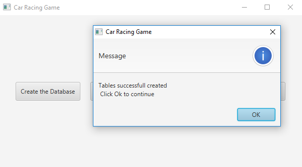

# [Car Game]
  - This game is created by using MySQL and JDBC.
  - The user must sign up with login ID and password.
  - The game starts when the user verifies his/her login ID and password in database. 

# [Programming Summary]
## The purpose of this project is to implement MySQL, JDBC, JDBC and manage user signup and login by utilizing user interface made by JavaFx
### 1. Devided into two sides, a system administrotor and a user.
#### 1) System adminitrator creates the database and its tables to store the suer inforation.
####    - JDBC and SQL (Create Databases and Tables, and Select, Input, and Update)
####    - For data storage, Javaio is used.
#### 2) Users register for their login IDs and passwords
####    - For the storage of ID, password, and other user information, Javaio is used.
####    - To verify the user information, equal() method is used which means all data type is String.
##### 
######
### 2. Creat a new database and table 
#### - By using MySQL, create a new database and tables. When it is successfully created, the message pops up.
#### 
